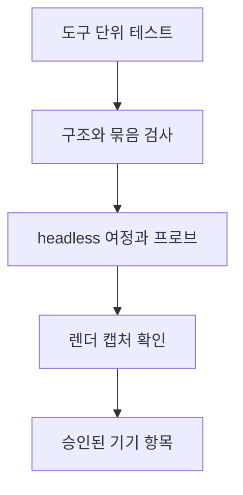

# 검수

검수 방법은 [검수 전략](test-strategy.md)에, 기능 목록은 `docs/qa/feature-inventory.json`에 있다. 출시 범위의 테스트 등급과 환경은 [테스트 계획](../design/2026-11-21-four-alike-launch/test-plan.json)을 따른다.

```mermaid
flowchart TB
  Unit["도구 단위 테스트"] --> Arch["구조와 묶음 검사"]
  Arch --> Journey["headless 여정과 프로브"]
  Journey --> Render["렌더 캡처 확인"]
  Render --> Device["승인된 기기 항목"]
```
